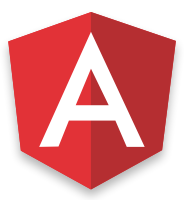

## Building Achievable Applications with flux


---

## Hi
<!-- consider just doing this without a slide? -->

- Front End @ <span style="font-family: monospace;">Braintree</span>
- JS all the time
- I pretend to write poetry

Note: if any of those things sound interesting to you, talk to me afterwards.

---

# What is Flux?


## TLDR;

- An architecture for client side applications <!-- .element: class="fragment fade" -->
- Created and used by Facebook <!-- .element: class="fragment" -->
- A philosophy, not a framework <!-- .element: class="fragment" -->


## Why?


<small class="citation">http://www.deviantart.com/art/quot-It-works-quot-Back-to-the-Future-273636472</small>


<small class="citation">https://github.com/GeppettoJS/backbone.geppetto</small>


<small class="citation">https://facebook.github.io/flux/img/flux-simple-f8-diagram-1300w.png</small>


- Change can be hard to reason about
- Adding new features can mean a lot of restructuring  <!-- .element: class="fragment" -->
- Onboarding gets harder <!-- .element: class="fragment" -->


Note: debugging the complicated network that leads to change on the front-end is a lot like time travel


### The Awful Truth

<p>Flux doesn't solve these problems, but <span>it does make them easier to reason about</span><!-- .element: class="fragment" data-fragment-index="1" --></p>

By providing: <!-- .element: class="fragment" data-fragment-index="2" -->

- a "pipeline" for change <!-- .element: class="fragment"  data-fragment-index="2" -->
- basic building blocks that scale <!-- .element: class="fragment" -->
- a simple philosophy <!-- .element: class="fragment" -->
- (a name that sounds cooler than MVC)<!-- .element: class="fragment" -->

---

## The core


<small class="citation">http://deimos-remus.deviantart.com/art/Back-to-the-Future-369164204</small>


## Unidirectional Data

<pre class="ascii highlight code-example" style="text-align: center"><span class="hljs-attribute">ACTION</span>------->>>>>>-------<span class="hljs-keyword" >DATA</span>------->>>>>>-------<span style="color: #6699cc;">VIEW</span>
|                                                    |
|                   ONE WAY FLOW                     |
|                                                    |
|<<<----------------<<<<----------------<<<----------|</pre>


## Flux Pipeline
<pre class="ascii highlight code-example" style="text-align: center">
<span class="hljs-tag">ACTION</span>---->>>----<span class="hljs-keyword">DISPATCHER</span>---->>>---<span class="hljs-literal">STORE</span>--->>>----<span class="hljs-function">VIEW</span>
  |                                                    |
  |                    ONE WAY FLOW                    |
  |                                                    |
  |<<<----------------<<<<----------------<<<----------|</pre>


## Components: Action

<pre class="code-example ascii">
<span class="hljs-tag">ACTION</span> >>> DISPATCHER >>>  STORE >>> VIEW
</pre>

- The catalyst of the data flow
- Dispatched to all stores

<pre class="code-example ascii">
  <span class="hljs-rules">{
    <span class="hljs-rule"><span class="hljs-attribute">type</span>:<span class="hljs-value"> <span class="hljs-string">'ADD_COMMENT'</span></span>,
    <span class="hljs-rule"><span class="hljs-attribute">data</span>:<span class="hljs-value"> { <span class="hljs-attribute">text: <span class="hljs-string">'Yay!' }</span>
</span></span>  }</span></pre> <!-- .element class="fragment code-example" data-fragment-index="1" -->

By the client: <!-- .element class="fragment" data-fragment-index="2" -->
```ruby
MessageButton.click(chatRoomActions.addMessage);
```
<!-- .element class="fragment" data-fragment-index="2" -->

And the server: <!-- .element class="fragment" data-fragment-index="3" -->

```ruby
Socket.on('connect', chatRoomActions.clientConnected);
```
<!-- .element class="fragment" data-fragment-index="3" -->

Note: make it clear that this isn't just an event, it's a method that allows you to dispatch and perform other operations?


### Components: Dispatcher

<pre class="code-example ascii">
ACTION >>> <span class="hljs-keyword">DISPATCHER</span> >>> STORE >> VIEW
</pre>


- the heart of a flux application
- publishes actions to registered stores
- manages dependencies between stores


### Components: Store

<pre class="code-example ascii">
ACTION >>> DISPATCHER >>> <span class="hljs-literal">STORE</span> >>> VIEW
</pre>

- source of truth for facets of application
- interprets _all_ dispatches and updates accordingly
- notifies subscribers of changes


<!-- .slide: data-transition="none" -->

### Components: View

<pre class="code-example ascii">
ACTION >>> DISPATCHER >>>  STORE >>> <span class="hljs-function">VIEW</span> >>> (<span class="hljs-tag">ACTION</span>)
</pre>

- Subscribes to stores
- Rerenders when stores change
- Triggers action creation
<p style="height: 130px;"></p>


<!-- .slide: data-transition="none" -->

### Components: View

<pre class="code-example ascii">
ACTION >>> DISPATCHER >>>  STORE >>> <span class="hljs-function">VIEW</span> >>> (<span class="hljs-tag">ACTION</span>)
</pre>

Data flows from the topmost "controller view"
<!-- mad props to kirk shoop for the code fragment trick http://stackoverflow.com/a/25396283/1048479 -->
<pre class="highlight code-example">
              <span class="hljs-tag">&lt;<span class="hljs-keyword">components</span>&gt;</span>
                        <span>&lt;all/&gt;</span> <!-- .element: class="fragment hljs-constant" -->
                            <span class="hljs-string">&lt;<span class="hljs-title">the</span>/&gt;</span> <!-- .element: class="fragment hljs-string" -->
                                <span>&lt;way/&gt;</span> <!-- .element: class="fragment hljs-attribute" -->
                                    <span class="hljs-hexcolor">&lt;<span class="hljs-title">down</span>/&gt;</span> <!-- .element: class="fragment hljs-hexcolor" -->
</pre><!-- .element: class="fragment hljs-hexcolor" -->


## Repeat...


---

### Example:

## Today I Learned


## Features

- Record the things we learn as 'tils'
- Comment on them with friends


### Setup:



We'll use Angular.

- Popular  <!-- .element: class="fragment" -->
- Fast <!-- .element: class="fragment" -->
- Solid services <!-- .element: class="fragment" -->
- (not React ^^) <!-- .element: class="fragment" -->


## Assumptions

- We'll user browserify and commonjs
  - not familiar? don't worry.
- We'll use an imaginary express/mongodb backend


## Code

[`https://github.com/nicktomlin/flux-talk`](http://github.com/nicktomlin/flux-talk)

---

## Start Simple


<video src="clips/step-one.mov" class="stretch" controls></video>

Note: consider adding a summary here that talks about how "pages" (and sub pages) are composed of the same components

---

## Let's componetize


## Benefits

Flux allows components to act freely, without needing to know too much.


## Structure

<pre class="code-example ascii">
  <span class="hljs-tag">&lt;ControllerView&gt;</span> <-- Initializes data
     <span class="hljs-keyword fragment" data-fragment-index=1>&lt;TilList tils="tils" /&gt;</span> <span class="fragment" data-fragment-index=1><-- just cares about tils</span>
     <span class="hljs-constant fragment" data-fragment-index=2>&lt;AddTil /&gt;</span> <span class="fragment" data-fragment-index=2><-- care free ^^</span>
  <span class="hljs-tag">&lt;/ControllerView&gt;</span>
</pre>


### Composition

- "Pages" and sub sections are made up components
- Each component depends on it's parent to provide data
- Only the top level of each "section" worries about data

<!--
  we can maintain a unidirectional flow of data, but still allow any component in the hierarchy
  to introduce meaningful change into our application through actions.
-->


```javascript
// til-list.js
module.exports = function tilList () {
  return {
    scope: {
      tils: '=tils'
    },
    templateUrl: 'til-list.html'
  }
}
```

```
// til-list.html
<div ng-repeat="til in tils">
  ...
    <h3>{{til.text}}</h3>
  ...
```
<!-- .element class="fragment" -->

```
<section>
  <til-list tils="tils"></til-list>
</section>
```
<!-- .element class="fragment" -->


<pre class="code-example javascript"><span class="hljs-comment"> // add-til.js</span>
 <span class="hljs-built_in">module</span>.exports = <span class="hljs-function"><span class="hljs-keyword">function</span> <span class="hljs-title">addTil</span> <span class="hljs-params">(clientActions)</span> </span>{
   <span class="hljs-keyword">return</span> {
       scope: {},
       <span class="fragment">template: <span class="hljs-string">'&lt;input ng-keyup="addTil($event)&gt;"'</span>,</span>
       <span class="fragment">link: <span class="hljs-function"><span class="hljs-keyword">function</span> <span class="hljs-params">($scope)</span> </span>{
         $scope.addTil = <span class="hljs-function"><span class="hljs-keyword">function</span> <span class="hljs-params">($event)</span> </span>{
           <span class="hljs-keyword">if</span> ($event.which === <span class="hljs-number">13</span>) {
             clientActions.addTil({
               text: $event.currentTarget.value
             });
             $event.currentTarget.value = <span class="hljs-string">''</span>
         }
       }</span>
     }
   }
 }  </pre>

```
<add-til />
```


All together:

```
<section ng-controller="index">
    <div class="input-group">
      <add-til />
    </div>

    <til-list tils="tils"></til-list>
</section>
```

---

## Adding additional store

Users


## Imaginary backend

<pre class="highlight xml code-example" style="font-size: .7em">

    <span class="hljs-attribute">/api</span>
      <span class="hljs-constant">/user</span>
      <span class="hljs-keyword">/til</span>

</pre>


### The Payload

```
  $http.get('/api/til').then(serverActions.receiveTils);
```

    {
      users: [{displayName: 'Nick Tomlin', _id: 'user-id'}],
      tils:[
        {
          _id: 'til-id',
          userId: 'user-id',
          text: 'A great thing'
        }
      ]
    }
<!-- .element: class="fragment" -->

```javascript
serverActions.receiveTils = function (res) {
  Dispatcher.dispatch({
    type: 'RECEIVE_TILS',
    data: {
      tils: res.data.til,
      users: res.data.user
    }
  });
};
```
<!-- .element: class="fragment" -->

Note: modeling choices are up to you and your backend; the problems i've encountered are similar to those in no-sql land: e.g. is this an embedded document or another collection entirely?


### Stores: User
<pre class="javascript code-example "> <span class="hljs-comment">// user-store</span>
 userStore.dispatchToken = dispatcher.register(<span class="hljs-function"><span class="hljs-keyword">function</span> <span class="hljs-params">(payload)</span> </span> {<span class="fragment" data-fragment-index="1">
   <span class="hljs-keyword">switch</span>(payload.type) {
     <span class="hljs-keyword">case</span> <span class="hljs-string">'RECEIVE_TILS'</span>:
       payload.data.users.forEach(addUser);
       userStore.emit(<span class="hljs-string">'change'</span>);
     <span class="hljs-keyword">break</span>;
 </span>}</pre>

```javascript
// user-store
function addUser (user) {
  _users[user._id] = user;
}

function get (userId) {
  return _users[userId];
}
```
<!-- .element: class="fragment" data-fragment-index="2"-->


### Stores: Til

```javascript
// til-store
switch(payload.type) {
  case 'RECEIVE_TILS':
    dispatcher.waitFor([userStore.dispatchToken]);
    payload.tils.forEach(addTil);
    tilStore.emit('change');
  break;
}
```

```javascript
// til-store
function addTil (til) {
  til.user = UserStore.get(til.userId);
  _tils[til.clientId] = til;
}
```
<!-- .element class="fragment" -->

---

## Adding a layer

Let's add comments.


## Imaginary Backend: Updated Api

<pre class="highlight xml code-example" style="font-size: .7em">

    <span class="hljs-attribute">/api</span>
      <span class="hljs-constant">/user</span>
      <span class="hljs-keyword">/til</span>
        <span class="hljs-tag featured-code">- [comments]</span>

</pre>


### Updated Payload

<pre class="code-example ascii highlight">
// GET /tils
{
  users: [{displayName: 'Nick Tomlin', _id: 'user-id'}],
  tils:[
    {
      _id: 'til-id',
      userId: 'user-id',
      text: 'A great thing',
      <span class="highlight fragment featured-code">comments: [{userId: 2, text: 'Nice Delorean'}]</span>
    }
  ]
}
</pre>


### Components

<pre class="code-example ascii">
  <span class="hljs-tag">&lt;ControllerView&gt;</span>
    <span class="hljs-keyword" data-fragment-index=1>&lt;TilList tils="tils"&gt;</span>
      <span class="hljs-function fragment" data-fragment-index=1>&lt;CommentList til="til"/&gt;</span>
    <span class="hljs-keyword" data-fragment-index=1>&lt;/TilList&gt;</span>

    <span class="hljs-constant" data-fragment-index=2>&lt;AddTil /&gt;</span>
  <span class="hljs-tag">&lt;/ControllerView&gt;</span>
</pre>


### Our component: javascript

```javascript
// components/comment-list/index.js
module.exports = function commentList (clientActions) {
  return {
      scope: {
        'til': 'til'
      },
      link: function ($scope) {
        $scope.addComment = function ($event) {
          // ...
          clientActions.addComment({
            text: $event.currentTarget.value,
            tilClientId: til.clientId,
            userId: '1' // hardcoded for simplicity
        });
      }
    }
  }
}
```
<!-- .element style="font-size: 0.42em" -->


### Our component: template

```html
<section class="panel-footer">
  <h5>Comments</h5>

  <article ng-repeat="comment in til.comments">
    <p>
      {{comment.text}}<small> - {{comment.user.displayName}}</small>
    </p>
  </article>

  <input type="text" ng-keyup="addComment($event, til)">
</section>
```
<!-- .element style="font-size: .51em;" -->


### Our action

```javascript
// app.js::clientActions
this.addComment = function (commentData) {
  dispatcher.dispatch({
    type: 'ADD_COMMENT',
    data: {
      comment: commentData
    }
  });
}
```
<!-- .element style="font-size: 0.42em" -->


### Our Stores: TilStore

```javascript
case 'ADD_COMMENT':
  dispatcher.waitFor([userStore.dispatchToken]);

  tilStore.addComment(payload.data.comment);
  tilStore.emit('change')
break;
```

```javascript
function addComment (comment) {
  var til = _items[comment.tilClientId];
  comment.user = userStore.get(comment.userId);
  til.comments.push(comment);
}
```
<!-- .element style="font-size: 0.42em" class="fragment" -->


---

## What have we done?!?

- Explored the flux "pipeline" <!-- .element class="fragment" -->
- Created powerful, discrete components <!-- .element class="fragment" -->
- Made ordered changes to data with store dependencies <!-- .element class="fragment" -->

Note: maybe include a "what could we do?" section that showcases optimistic rendering, a log of actions etc...
---


### Frameworks!


- [delorean](https://github.com/deloreanjs/delorean)
- [marty.js](https://github.com/martyjs/marty)
- [fluxxor](https://github.com/BinaryMuse/fluxxor)
- [flummox](https://github.com/acdlite/flummox)
- ... and many more

Note: To dive in i'd first suggest using Facebook's "vanilla" flux implementation, and then using a framework


---

## Not so fun stuff :(


- Large mental footprint
- Boilerplate <!-- .element: class="fragment" -->
- BYO everything <!-- .element: class="fragment" -->
- No clear conventions <!-- .element: class="fragment" -->


---

## Resources

- [flux documentation](https://facebook.github.io/flux/docs/overview.html#content)
- [awesome react flux tutorials](https://github.com/enaqx/awesome-react#flux-tutorials)
- [Yahoo's flux examples](https://github.com/yahoo/flux-examples)
- [building angular apps with flux](http://victorsavkin.com/post/99998937651/building-angular-apps-using-flux-architecture)
- [flux and relay](https://facebook.github.io/react/blog/2015/02/20/introducing-relay-and-graphql.html)

---

## Thanks


* @itsnicktomlin
* github.com/nicktomlin

